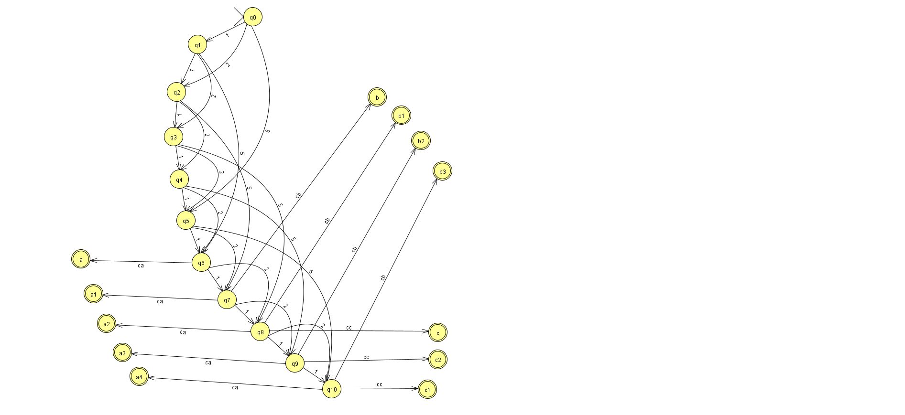

# 🍭 Maquina de Doces 🍫
Projeto desenvolvido para a Unidade curricular 'Teoria da computação e compiladores' na Universidade São Judas Tadeu (USJT).

## Objetivo 🧁
A criação de um AFD e implemente uma animação (em qualquer linguagem de programação, como se fosse um jogo) que funcione como um AFD para o seguinte cenário:
- Em uma máquina de Doce pode ser inserida somente três tipos de Nota/moeda (R$1,00, R$ 2,00 e R$ 5,00).
- Há três tipos de doces na máquina (Doce A = R$ 6,00, Doce B = R$ 7,00 e Doce C = R$ 8,00).
- O Cliente deverá inserir as notas/moedas e a máquina deverá ativar as opções de doces, conforme os valores forem sendo atingidos.
- Possíveis finais: Doce A sem troco, Doce B sem troco, Doce C sem troco, Doce A com troco, Doce B com troco, Doce C com troco.

## Diagrama 🍩
Dicionário:
- qn = estados definidos (quantidade em carteira/saldo sendo 'n' o valor).
- an, bn, cn = estados terminais, sendo 'n' o valor de retorno.
- 1, 2, 5 = valores de entrada (input).
- ca, cb, cc = valores de saída de acordo com o produto (compra a, compra b, compra c).

  

## HTML 🍧

  

https://user-images.githubusercontent.com/57200000/141985552-d6dcc587-a7eb-48d7-b06d-ddd5a2d6fe04.mov

## Desenvolvedores 🍡
- [Lucas Ancelmo](https://github.com/lucasancelmodias)
- [Matheus Albuquerque](https://github.com/matgomalb)
- [Rayssa Banti](https://github.com/rayssabanti)
- [João Vitor](https://github.com/joaovbds4)
- [Johnathan Seara](https://github.com/johwSeara)
